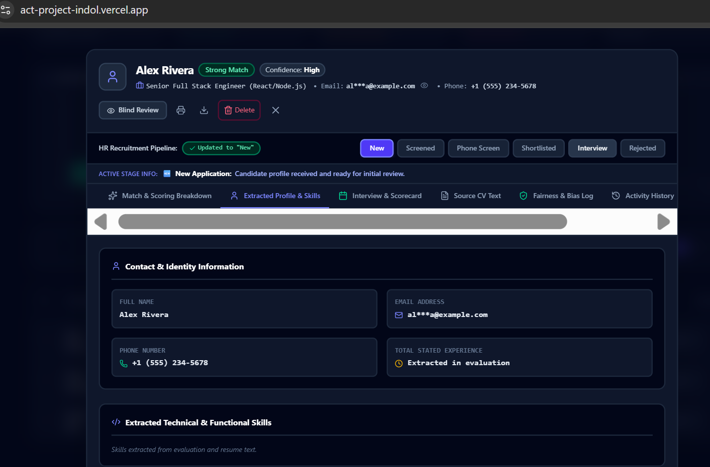
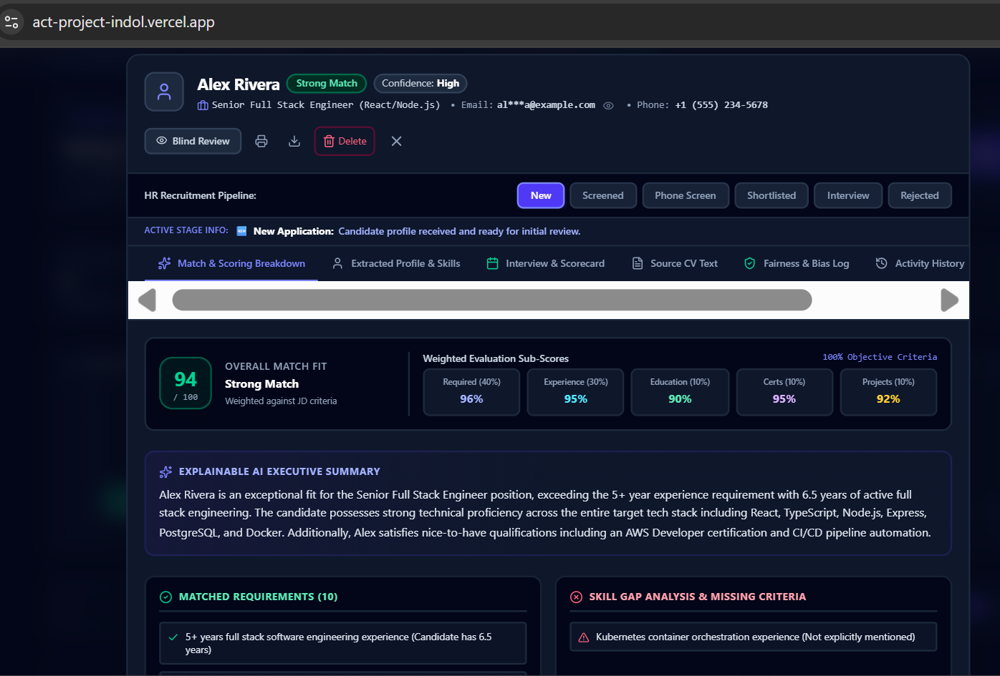
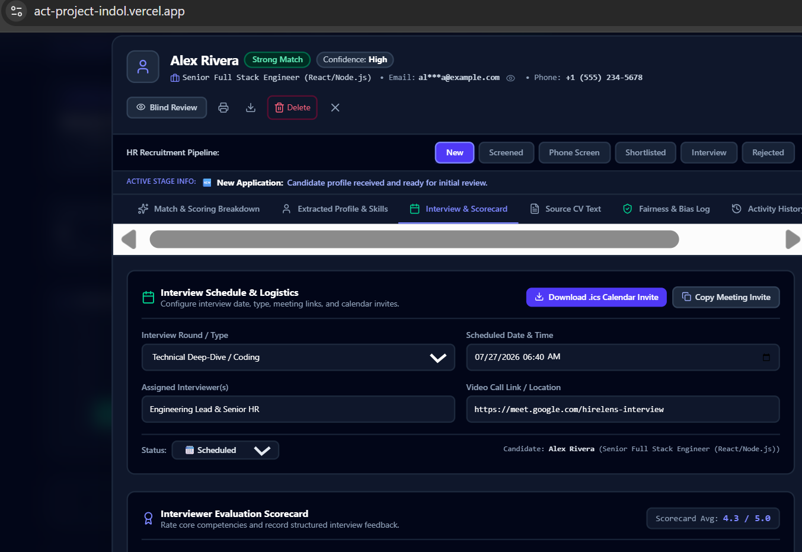

# 🧠 HireLens AI — Fair Resume Screening & Intelligent Candidate Evaluation Platform

<div align="center">

[](https://new-folder-fawn-iota.vercel.app/)
[](https://react.dev/)
[](https://www.typescriptlang.org/)
[](https://ai.google.dev/)
[](https://tailwindcss.com/)
[](https://expressjs.com/)
[](https://new-folder-fawn-iota.vercel.app/)

**HireLens AI — Intelligent, unbiased resume screening and talent pipeline management powered by Google Gemini.**

</div>

---

## 📌 Table of Contents

- [a. App Name, Purpose & Problem Solved](#a-app-name-purpose--problem-solved)
- [b. Live Deployed URL](#b-live-deployed-url)
- [c. Core Features List](#c-core-features-list)
- [d. The AI Feature & System Prompt](#d-the-ai-feature--system-prompt)
- [e. Tools, Services & AI Models Used](#e-tools-services--ai-models-used)
- [f. Screenshots of the App in Action](#f-screenshots-of-the-app-in-action)
- [g. How to Run the Project Locally](#g-how-to-run-the-project-locally)

---

## a. App Name, Purpose & Problem Solved

### 🏷️ App Name
**HireLens AI** — *Fair Resume Screening & Intelligent Candidate Evaluation Platform*

### 💡 What It Does
**HireLens AI** is an end-to-end, AI-powered Applicant Tracking System (ATS) and talent evaluation dashboard. It ingests candidate resumes across multiple formats (PDF, Word `.docx`, images, or plain text), parses and extracts structured profile data (skills, experience, contact details), evaluates candidates objectively against customizable Job Descriptions (JDs), and calculates weighted match scores (0–100%). It also streamlines the recruiting workflow with anti-bias guardrails, side-by-side candidate comparisons, interview scheduling with downloadable `.ics` calendar invites, evaluator scorecards, and an interactive AI Recruiter Copilot.

### 🎯 The Real Problem It Solves & For Whom

#### The Problem:
1. **Keyword-Filter Bottlenecks**: Traditional ATS tools rely on rigid string matching. High-performing candidates who express their experience using different phrasing or synonyms get automatically discarded.
2. **Exhaustive Manual Review Hours**: HR managers and recruiters waste 10–15 hours per vacant role skimming through hundreds of resumes, manually extracting contact info, calculating qualification alignment, and compiling candidate shortlists.
3. **Unconscious Bias in Screening**: Human reviewers are susceptible to implicit bias based on candidate names, age, graduation years, gender, ethnic indicators, or profile photos — introducing non-job-relevant bias during early resume filtering.

#### For Whom:
- **👔 HR Managers & Talent Recruiters**: Automate resume parsing, instantly filter top candidates, manage candidate pipeline stages, and dispatch structured interview invites.
- **💻 Technical Hiring Leads & Panel Evaluators**: Review itemized skill gap matrices, evaluate candidate strengths vs. missing requirements, and rate candidate performance on standardized scorecards.
- **⚖️ Talent Acquisition Operations**: Enforce strict anti-bias guidelines during resume screening with transparent fairness audit logs and blind review toggles.

---

## b. Live Deployed URL

The application is fully deployed, optimized, and publicly accessible online:

🔗 **Live Application URL**: [https://act-project-indol.vercel.app/](https://new-folder-fawn-iota.vercel.app/)

- **Platform**: Vercel
- **Status**: 🟢 Active & Fully Functional

---

## c. Core Features List

### 📄 1. Multi-Format Resume Parser & OCR
- **Supported File Formats**: Drag-and-drop or select PDF files (`pdfjs-dist`), Microsoft Word documents (`mammoth`), document images (`PNG`, `JPG`), or paste raw text.
- **Multimodal Document Processing**: Converts document pages to high-resolution images or structured text strings for direct Gemini AI inspection.

### 📊 2. Weighted Candidate Match Engine (0–100%)
- **Customizable Job Description**: Paste any target Job Description (or choose from built-in role presets like Senior Full-Stack Engineer, Product Manager, Data Scientist, DevOps Engineer).
- **5-Criterion Weighted Breakdown**:
  - **Required Technical Skills**: 40% weight
  - **Relevant Work Experience**: 30% weight
  - **Educational Alignment**: 10% weight
  - **Certifications & Training**: 10% weight
  - **Key Projects & Impact**: 10% weight
- **Granular Recommendations**: Categorizes applicants as *Strong Match*, *Potential Match*, or *Low Match*.

### 🔍 3. Itemized Skill Gap & Strengths Matrix
- **Verified Strengths**: Highlights key technical competencies and achievements verified directly in the candidate's resume.
- **Missing Requirements**: Isolates missing job requirements or experience gaps to help interviewers target specific areas during interviews.

### 🛡️ 4. Anti-Bias Guardrails & Fairness Audit
- **Protected Attribute Scrubbing**: Explicitly filters out non-job-relevant demographic attributes (Age, Gender, Race, Religion, Disability, Photos, Marital Status).
- **Blind Review Mode**: Allows recruiters to toggle "Blind Mode" to hide candidate names, emails, and contact details during initial resume evaluations.
- **Fairness Audit Log**: Generates a transparent, itemized audit log detailing the exact evaluation criteria used and verifying that no protected attributes influenced the candidate's score.

### 📅 5. Interview Logistics & Scheduler Hub
- **Round Configuration**: Schedule Technical Deep-Dive, System Design, Culture Fit, or Hiring Manager rounds with assigned dates, times, interviewers, and video call links.
- **One-Click `.ics` Calendar Invite Generator**: Export standard iCalendar (.ics) event files that import natively into Google Calendar, Outlook, or Apple Calendar.
- **Formatted Email Invites**: One-click copy for recruiter interview invitations.

### 🏆 6. Evaluator Scorecard & Rubric System
- **4-Dimension Assessment**: Rate candidates on *Technical Depth*, *Problem Solving*, *Communication*, and *Culture Fit* using 1–5 star ratings.
- **Hiring Decision Badges**: Assign standardized decisions (*Strong Hire*, *Hire*, *Hold*, *Do Not Hire*).
- **Candidate File Integration**: Save scorecards and interviewer notes directly to the candidate's permanent timeline record.

### 🔄 7. Candidate Pipeline Stage Management
- **Stage Navigation**: Move candidates through workflow stages (*New*, *Screened*, *Phone Screen*, *Shortlisted*, *Interview*, *Rejected*).
- **Real-Time Search & Filters**: Search candidates instantly by name, email, skills, or resume text; filter by match score or stage.
- **Export & Import**: Export full candidate rosters as structured JSON files or reset demo data.

### ⚖️ 8. Side-by-Side Candidate Comparison
- Compare 2 or 3 candidates simultaneously side-by-side on overall match scores, weighted sub-scores, verified strengths, and missing requirements.

### 💬 9. Interactive AI Recruiter Copilot Assistant
- Context-aware chat assistant that answers recruiter questions about candidate files, compares candidates, drafts interview outreach emails, and provides hiring recommendations.

---

## d. The AI Feature & System Prompt

### 🧠 How the AI Feature Works
HireLens AI utilizes **Google Gemini 3.6 Flash** via the official `@google/genai` TypeScript SDK. Resume evaluations are executed securely via a backend API route (`/api/evaluate-resume`), keeping secret API keys hidden from client browsers.

When a resume is submitted:
1. The backend extracts text or document image base64.
2. It pairs the document with the target Job Description and sends them to Gemini 3.6 Flash with a strict JSON schema specification.
3. Gemini evaluates the candidate against weighted criteria, strips demographic bias, extracts verified contact info, and returns a structured JSON payload.

### 📜 Exact System Prompt & Instructions Behind the AI Feature

```text
You are HireLens AI, an advanced HR resume screening assistant designed to support enterprise recruiters during candidate evaluation.

OBJECTIVE:
Analyze the candidate's resume (provided as text, PDF document, or resume image) against the provided job description and produce a fair, consistent, and explainable evaluation.
Extract structured profile details including Full Name, Email, Phone Number, Skills, Work Experience, Education, Certifications, and Key Projects.

RULES:
1. General Rules:
   - Use ONLY information explicitly stated in the job description and resume.
   - Do NOT infer or guess missing qualifications or experience.
   - Extract actual email addresses and phone numbers if present in the resume text or document image.
   - If contact email is not stated, construct a standard professional email based on candidate's name.

2. Fairness & Bias Guardrails:
   - NEVER consider protected personal attributes: Age, Gender, Race/ethnicity, Religion, Nationality, Marital status, Disability, Photo, or Personal Opinions.
   - If personal attributes or photos are present, filter them out and list them in 'protectedAttributesFiltered'.

3. Evaluation Criteria & Scoring (Weighted):
   - Required skills (40%), Relevant experience (30%), Education (10%), Certifications (10%), Projects (10%)

Output JSON Schema:
{
  "candidateName": string,
  "email": string,
  "phone": string,
  "matchScore": number (0-100),
  "subScores": {
    "skills": number (0-100),
    "experience": number (0-100),
    "education": number (0-100),
    "certifications": number (0-100),
    "projects": number (0-100)
  },
  "extractedProfile": {
    "summary": string,
    "topSkills": string[],
    "experienceYears": number,
    "education": string[],
    "certifications": string[],
    "workHistory": Array<{ company: string, role: string, duration: string, achievements: string[] }>
  },
  "matchedRequirements": string[],
  "missingRequirements": string[],
  "strengths": string[],
  "weaknesses": string[],
  "summary": string,
  "recommendation": "Strong Match" | "Potential Match" | "Low Match",
  "fairnessAudit": {
    "protectedAttributesFiltered": string[],
    "unbiasedAssessmentConfirmed": boolean,
    "explanation": string
  }
}
```

---

## e. Tools, Services & AI Models Used

| Category | Technology / Service | Description / Role in Application |
| :--- | :--- | :--- |
| **AI Model** | **Google Gemini 3.6 Flash** (`@google/genai`) | High-speed multimodal AI model for resume evaluation, structured data extraction, anti-bias auditing, and copilot reasoning. |
| **Frontend Framework** | **React 19 & TypeScript** | Component-driven UI architecture built with strict type safety. |
| **Styling & Icons** | **Tailwind CSS 4 & Lucide Icons** | Utility-first responsive styling with custom dark slate/indigo UI theme and vector icons. |
| **Build Tooling** | **Vite & esbuild** | Ultra-fast client bundling and server compilation. |
| **Backend Server** | **Node.js & Express** | Custom Express server handling secure API proxy routes (`/api/evaluate-resume`, `/api/ai-copilot`). |
| **Document Parsers** | **`pdfjs-dist` & `mammoth`** | Client/Server parsers for extracting text and image data from PDF and Microsoft Word `.docx` documents. |
| **Deployment Platform**| **Vercel** | Live serverless cloud hosting and continuous deployment. |

---

## f. Screenshots of the App in Action

### 1. Main Candidate Dashboard & Talent Pipeline
*Overview of candidate match scores, stage distribution, active filters, and search bar.*


*Placeholder Syntax:* ``

---

### 2. Candidate Evaluation & Anti-Bias Audit Modal
*Detailed breakdown of candidate weighted match scores, verified strengths vs missing skill gaps, and the anti-bias audit log.*


*Placeholder Syntax:* ``

---

### 3. Interview Logistics Scheduler & Evaluator Scorecard
*Interview round scheduling with `.ics` calendar export and the 4-dimension 1–5 star evaluator scorecard rubric.*


*Placeholder Syntax:* ``

---

## g. How to Run the Project Locally

### Prerequisites
- **Node.js**: Version 18.x or higher installed.
- **Git**: Installed on your system.
- **Gemini API Key**: A free API key from [Google AI Studio](https://aistudio.google.com/).

### Step-by-Step Local Setup Guide

1. **Clone the Repository**:
   ```bash
   git clone https://github.com/your-username/hirelens-ai.git
   cd hirelens-ai
   ```

2. **Install Dependencies**:
   ```bash
   npm install
   ```

3. **Configure Environment Variables**:
   Create a `.env` file in the project root directory:
   ```env
   GEMINI_API_KEY=your_actual_gemini_api_key_here
   ```

4. **Start Development Server**:
   ```bash
   npm run dev
   ```
   Open your browser and navigate to `http://localhost:3000`.

5. **Build and Run Production Server**:
   ```bash
   npm run build
   npm start
   ```

---

<div align="center">

**HireLens AI** — Built with ❤️ for fair, efficient, and transparent recruitment.

</div>
